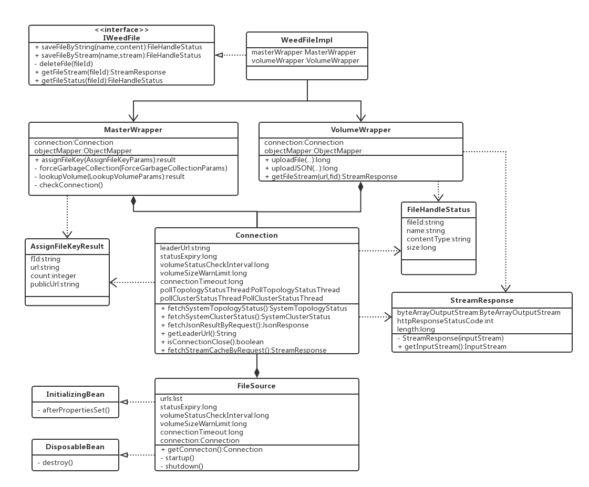

# SeaweedFS Client For Java
## 使用方式
### pom.xml:  
```xml
<dependency>
    <groupId>com.simu.gdr</groupId>
    <artifactId>weed-client</artifactId>
    <version>1.0-SNAPSHOT</version>
</dependency>
```
### application config  

```yml
weed:
  servers:
    urls: 192.168.1.204:9333,192.168.1.100:9333,192.168.1.200:9333
  auth:
    accessId: MtwtIlsti1P6UKDx
    accessKey: JN7fXj9sNPbLkfUTQh1zcJpwLPncHo
  subscriber:
    email: 15950570277@163.com
    phone: 15950570277
```
### Spring Bean Config  
```java
@Configuration
public class FileSourceConfig {

    @Bean("warningSendUtil")
    public WarningSendUtil getWarningSendUtil(@Value("${weed.subscriber.email}")String email, @Value("${weed.subscriber.phone}")String phone){
        return new WarningSendUtilImpl(email, phone);
    }

    @Bean("fileSource")
    public FileSource getFileSource(@Value("${weed.servers.urls}")String urls, @Qualifier("warningSendUtil")WarningSendUtil warningSendUtil) throws Exception{
        FileSource fileSource = new FileSource();
        fileSource.setUrls(Arrays.asList(urls.split(",")));
        fileSource.setConnectionTimeout(1000);
//        fileSource.setStatusExpiry(5);
        fileSource.setVolumeStatusCheckInterval(20 * 60); //volume节点状态每隔20分钟更新一次
        fileSource.setWarningSendUtil(warningSendUtil);
        fileSource.startup();
        return fileSource;
    }

    @Bean("fileTemplate")
    public FileTemplate getFileTemplate(@Qualifier("fileSource") FileSource fileSource){
        return new FileTemplate(fileSource.getConnection());
    }
}
```
### 在代码中使用，以上传文件为例，可以参考该组织的另一个项目dfs-proxy  
```java
@Autowired
FileTemplate fileTemplate;//注入bean

@Override
public void putFile(MultipartFile file, String path, String bucket) throws Exception {
    Bucket buck = bucketDao.getBucketByName(bucket);
    if (null == buck) {
        throw new ErrorCodeException(ResponseCodeEnum.BUCKET_NOT_EXIST);
    }
    String fileName = FileUtil.getSimpleFileName(path);
    String purePath = FileUtil.getPurePath(path);
    File fileEntity = fileDao.getFileByPath(buck.getId(), purePath, fileName);
    if (null != fileEntity) {
        // 删除原文件重新上传
        fileTemplate.deleteFile(fileEntity.getNumber());
        FileHandleStatus fileHandleStatus = fileTemplate.saveFileByStream(fileName, file.getInputStream());
        fileEntity.setNumber(fileHandleStatus.getFileId());
        fileEntity.setModifyTime(TimeUtil.getCurrentSqlTime());
        fileEntity.setSize(fileHandleStatus.getSize());
        fileEntity.update();
    } else {
        // assign key 单点故障;
        // 运行时有master宕机的情况(1. peer挂 2.leader挂) 主动发现和被动发现
        FileHandleStatus fileHandleStatus = fileTemplate.saveFileByStream(fileName, file.getInputStream(), bucket);
        fileEntity = new File(fileName, fileHandleStatus.getFileId(), purePath, fileHandleStatus.getSize(), buck.getId());
        fileEntity.setFolderId(createFolders(purePath, buck.getId()));
        fileEntity.save();
    }
}
```

## 设计思路

&emsp;&emsp;该模块对外只通过IWeedFile暴露接口提供服务(目前是FileTemplate)，从上图也能看出，IWeedFile接口中包含了存取文件所必需的方法，它的实现类依赖与两个Wrapper完成底层功能，分别是MasterWrapper和VolumeWrapper，这也对应了SeaweedFS系统中的两个角色Master和Volume。
其中Master主要的作用就是负责管理与之关联的Volume，而Volume负责实际的文件存取。以调用IWeedFile接口的saveFileByStream为例，在上传文件前需要先向Master请求分配给待上传文件的fid和对应的volume，即图中的AssignFileKeyResult，
然后利用这个对象里的信息向对应的volume传输文件，从而完成文件写入。MasterWrapper和VolumeWrapper完成各自的职责，符合单一职责的原则，有利于提高内聚性。  
&emsp;&emsp;由于在MasterWrapper和VolumeWrapper中均需要通过发送http形式的请求才能完成最终的工作，所以将发送http请求的任务剥离出来形成具有独立职能的Connection类，该类主要功能就是负责将请求数据通过http形式发送并获取解析返回值。
另外，由于该类承担的是网络层的工作，因此检测网络或者系统的可用性任务也由该类完成，它在初始化的同时会初始化两个线程PollClusterStatusThread和PollSystemTopologyStatusThread，前者用于检测集群中各个master节点的状态，
并在有master节点不可达集群重新选举leader之后更新其leaderUrl的属性，后者用于检测volume节点的容量相关的信息。这是主动检测的策略，但因为主动检测有一定的时间间隔，因此会有延迟，系统还加入了被动检测的功能，
即在上游访问特定接口时会先checkConnection，如果发现异常会立即同步进行节点更新操作，虽然这次调用的时间会变长，但不影响结果的正确性和系统的可用性。  
&emsp;&emsp;此外，由于Connection属于底层的组件，不应该对外暴露，所以初始化的工作就由它的上层组件FileSource类完成，为了能够更好地在Spring容器的环境中使用，FileSource会实现Spring框架中的两个接口InitializingBean和DisposableBean，
前者用于在Spring Bean初始化之后将Connection启动，后者用于在Bean销毁之后终止Connection中的线程，即调用shutdown方法。还有一点与Connection不同的是，在初始化FileSource的过程中，需要传入一个url列表，
该列表是集群中所有master节点的ip和端口号组合，这是为了防止在系统启动的时候设定了单个master而该master节点刚好不可达导致系统无法启动的问题。

